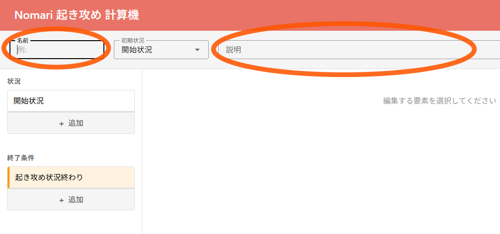
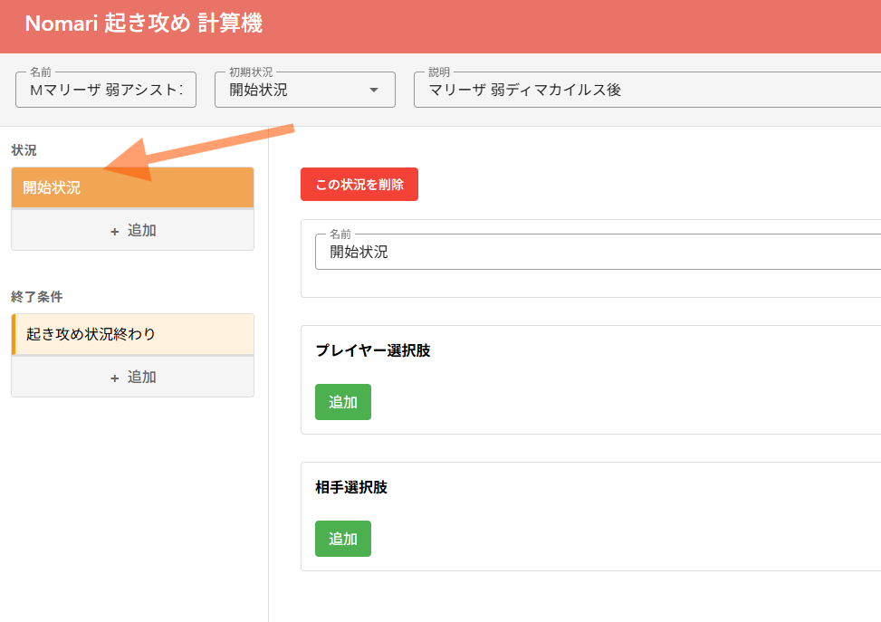
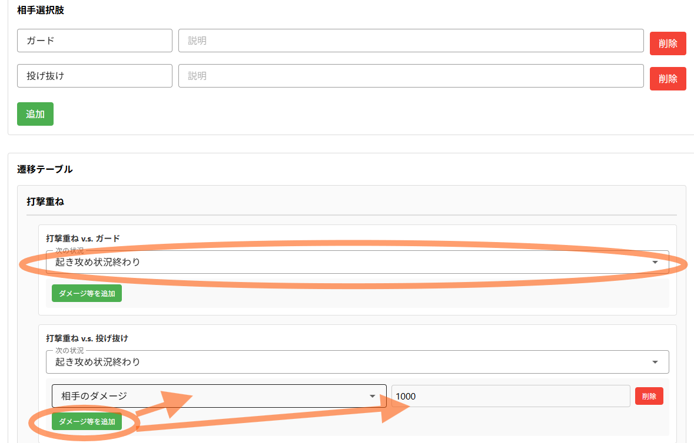
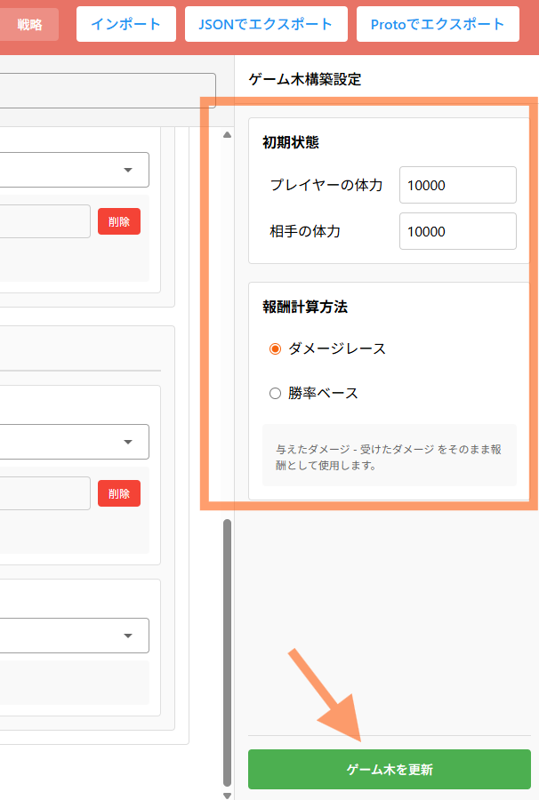
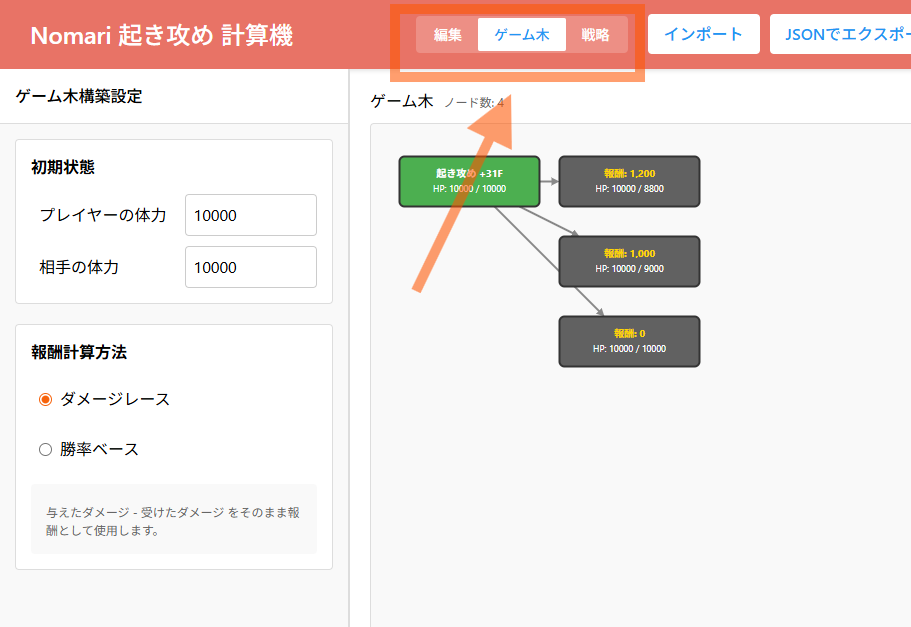
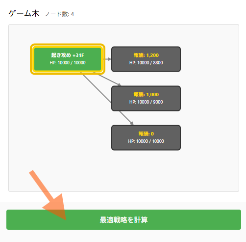
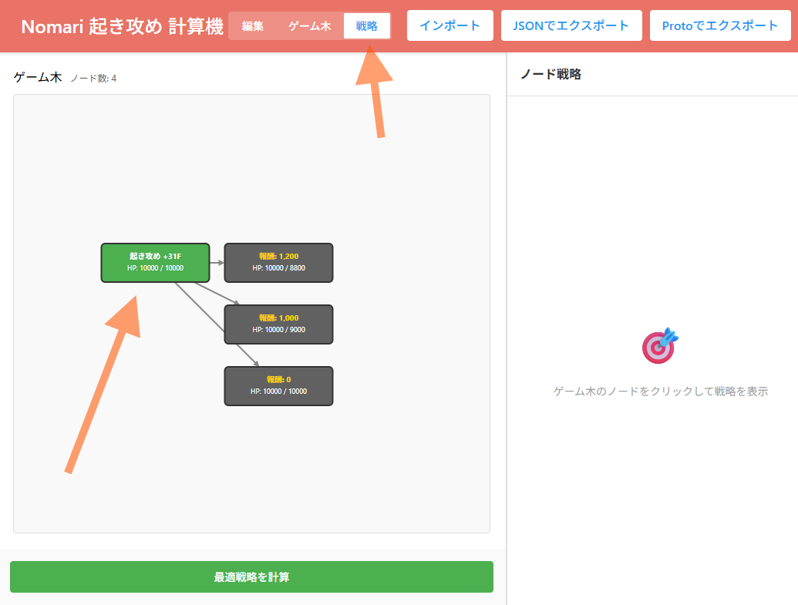
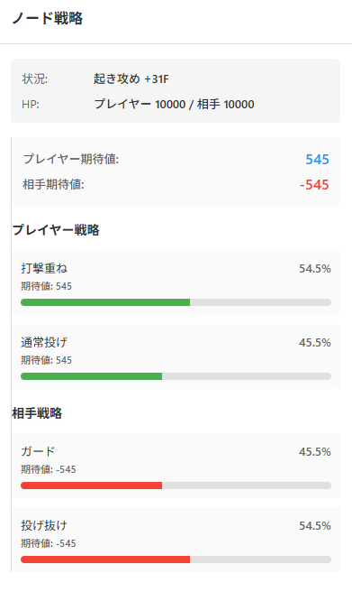

# Nomari の使い方

このページでは Nomari を使って起き攻め状況での最適な攻防の戦略の計算の方法を説明します。

## はじめに

Nomari ではポーカーの世界で有名な GTO戦略 (Game Theory Optimal戦略) を格闘ゲーム向けに計算するためのツールです。

- 状況一覧
- 各状況でプレイヤーと相手の取りうる行動の選択肢
- それぞれの行動の組み合わせで何が起こるか（ダメージやコンボの起き攻め状況）
- 終了状況

などを指定することで、各状況で数学的に最適な戦略を計算することができます。
実際にやってみたほうが分かりやすいので、あまり実践的では無いですが1番簡単な例から始めてみましょう

## 簡単なデモ
簡単なデモを見るのが1番雰囲気がわかるかもしれません。
https://palthedog.github.io/nomari/?example=marisa

## やってみよう

まずは [Nomari 起き攻め　計算機](https://palthedog.github.io/nomari/) を開きましょう。

画面の上の方に今から調べる状況についての名前や説明文を書くことができます。
ここはただの名前なので、自分がわかりやすければ何でもOKです。
今回は**マリーザの弱ディマカイルス後の起き攻め**について調べてみましょう。

---

次に「開始状況」をクリックして選択してください。

右半分に選択した状況について記述する画面が表示されます

---

## 状況の記述
デフォルトで「開始状況」などの名前が入っていますが、「起き攻め +31F」など後から自分で理解しやすい名前をつけておくと安心です。
有利フレーム数でなく「弱ディマカイルス後」などの名前もオススメです。

## 選択肢を列挙する

次にプレイヤーの攻撃手段を入力します。まずは簡単な例から始めたいので
- 打撃重ね (DR > 溜引き強パンチが重なる）
- 投げ重ね (DR > 通常投げが重なる）
を調べてみましょう。

「プレイヤー選択肢」の枠にある「追加」ボタンを2回押して「打撃重ね」「通常投げ」を入力してください

相手側の防御手段にはどのようなものがあるでしょうか？　まずはシンプルな例として
- ガード
- 投げ抜け (最速投げ抜け）
を試してみましょう。

プレイヤーの時と同様に「相手選択肢」の枠の中にある「追加」ボタンを2回押して「ガード」と「投げ抜け」を追加してください。

以下の画像のようになっていれば大丈夫です。説明欄には自分が後から詳細を思い出すのに必要なメモを残しておくのがオススメです。

# 行動の結果を入力

プレイヤー、相手側それぞれの選択肢を入力したら、それぞれの行動がどんなダメージを生むか等を入力していきます。
下の方にスクロールしていくと、「遷移テーブル」という項目が見つかりますので、そこへ入力していきましょう。

プレイヤー側が「打撃重ね」を選び、相手側が「ガード」を選んだ時は何が起こるでしょうか？
- ダメージは発生しない
- ODゲージが削れる
    (Nomari はまだ ODゲージの増減には対応していないですが、要望があれば実装します）
- 8F有利

連続ガードを作ってさらにDゲージを削って、一旦仕切り直しとしましょう。
読み合いの状況が一旦終わりということで、「次の状況」で「起き攻め状況終わり」を選択してください。

「打撃重ね」と「投げ抜け」の場合はどうでしょうか？
- 相手に1000ダメージ
    普通はそのままコンボにいきますが、1番簡単な例なので1発殴って終わりにしておきます
- こちらも一旦攻め継続せずに、仕切り直しとしておきます

「次の状況」は「起き攻め状況終わり」をするのは同じですが、今回はダメージについての情報を追加しましょう。

「ダメージ等を追加」ボタンを押したら「相手のダメージ」を選び、ダメージ量を「1000」にしましょう。
下の画像のようになっていれば大丈夫です。

---

## ゲーム木を作る
これで
    - 攻撃側：1発殴る　か　投げ
    - 防御側：ガード　か　投げ抜け
の1番単純な読み合いについての情報の入力が終わりました。

画面右下の「ゲーム木を更新」ボタンを押してゲーム木を作ってみましょう。上半分の「プレイヤーのHP」などは一旦無視して大丈夫です。

下のようなゲーム木が表示されましたか？　もし表示されなかったら上のパネルの「ゲーム木」ボタンを押してみてください。
何か違う点があれば、「編集」ボタンから状況の編集に戻ることができます。

### ノードについて

ゲーム木内に見える1つ1つの四角い箱を「ノード」と呼びます。

状況を編集する時に私たちは残りHPなどは考慮せずに選択肢を入力しましたが、最適戦略を計算するときには Nomari が自動的にHPの変動を計算し、別々のより細かい状況での戦略を計算します。

この残りHPなどを考慮した細かい状況のことを 「**ノード**」 と呼びます。

---

## 最適戦略を求める

いよいよ最適戦略を求めてみましょう。ゲーム木の下にある「最適戦略を計算」ボタンを押してください。

戦略を表示するパネルが表示されたでしょうか？　次にゲーム木から「起き攻め +31F」のノードをクリックしてください

---

## 最適戦略を確認する

各項目を確認してみましょう

### プレイヤー期待値・相手期待値
それぞれのプレイヤーがこの状況で得られる報酬の期待値になります。
（期待値とは**平均して**これだけの報酬が得られるという意味です）

ここでいう報酬とは与えられるダメージのことですが、ゲーム木を作る時の設定で**勝率**を元にした計算に変えることも可能です。
(ダメージを元にした計算が1番直感ではありますが、勝率を元に計算したほうが「画面端脱出」などを考慮できるのでより実践的になります）

### プレイヤー戦略
ここではプレイヤー側（攻撃側）の最適戦略を確認できます。この画像の例では

- 打撃重ねを 54.5%
- 通常投げ重ねを 45.5%

の確率でそれぞれを出すのが最適戦略だといえます。これよりも高い頻度で打撃重ねを選ぶと、防御側はその偏りを利用することでダメージ量を減らすことができます。

### 相手戦略
ここでは同様に相手側（防御側）の最適戦略を確認できます。今回の例では

- ガードを 45.5%
- 投げ抜けを 54.5%

の確率で出すのが、平均して最もダメージを少なく抑えることができます。

---

### 最適戦略って何？
ここでいう「最適戦略」とは何なのでしょうか？　一言で言うと「相手が読み合いの天才でも負けない戦略」なのですが、理論的な説明は長くなるので [**別のページ**](./game_theory/README.md) で詳しく解説します。

## もう少し複雑な例
今回は Nomari 極めて単純な状況を作成しましたが

- 柔道による局面のループ
- 起き攻めからコンボにつないで、また別の起き攻め状況へ。。。

など、より複雑な状況での最適戦略や

- 防御側が画面端を脱出することによる勝率の変化
- 体力差の考慮、リーサルが見えている状況

などでの勝率を元にした最適戦略の計算なども行えます。以下のページではいくつかの例を紹介します。

[他の状況の例](./examples.md)
