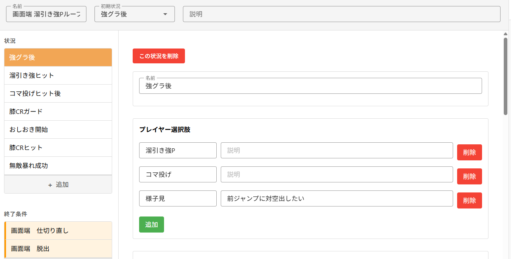
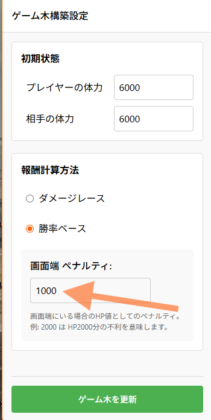
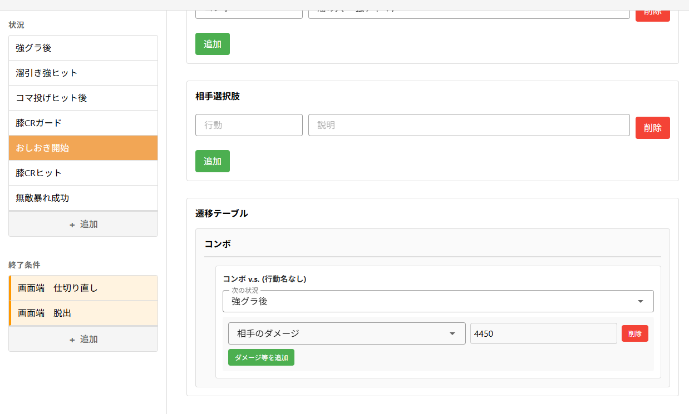
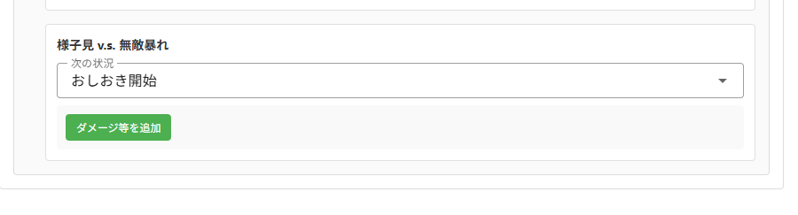

## マリーザ　画面端の4HPコンボ

画面端で **引き大パンコンボ**から**強グラディウス**で締めてループする有名なセットアップ

参考: [【SF6/マリーザ】最新版マリーザ講座！！これを覚えればほぼ俺と同じです。【シュート】](https://youtu.be/gMS2aOYuu54?si=_Qt4pqfivnFYY-5I&t=752)

### 試してみる

[**インポート可能なファイルをダウンロード**](https://raw.githubusercontent.com/palthedog/nomari/master/documents/ja/examples/example_4hp_loop.pb)

上のファイルをダウンロードしたら、Nomari 上の「インポート」ボタンからインポートしてください。

### 結果

---

---

## ヒント

### 勝率の計算ルール

この例では行動の報酬を「予測される勝率」を元に計算するモードを使っています。

- 相手のHPが0になった時に最大(10000)
- プレイヤーと相手のHPの比率
- 画面端を背負っていると不利

等の情報から概算していますが、現状かなりシンプルな方法に頼っているので今後色々なアイデアを試してみたい所です。
- ODゲージ、SAゲージを考慮する
- ワンタッチ同士なら HP:200 と 400 にそんなに差は無いはず？

勝率の計算における画面端のペナルティの量を変更することで、コマ投げの価値が大きく動くこともわかります。色々と試してみると面白いかもしれません。

例えば、画面端のペナルティを増やすと、コマ投げのリスク(前ジャンプで逃げられる)があがるので頻度が下がる

### 同じようなルールを何度も書くのが面倒くさい！

同じような遷移のルールを何度も書くのが面倒なら、その遷移用に新しい状況を作ってあげて、そこへ遷移することで入力の手間を省けます。

例えば、色々な状況の中で何度も「ガード v.s. 無敵暴れ」を書くたびに `1600ダメージ。仕切り直しへ遷移`と入力するよりも、「おしおき開始」の状況を1つ作った上で、その状況への遷移を作ってあげるほうがシンプルな構成にできます

「おしおき開始」の状況

他の状況から「おしおき開始」への遷移を指定

---
